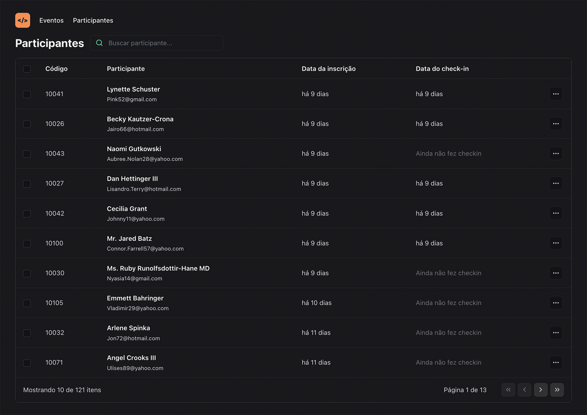

# PassIn App

O PassIn foi um projeto desenvolvido no evento NLW Unite, da escola de programação RocketSeat. O objetivo foi criar, simultaneamente em várias tecnologias, uma aplicação para cadastro de eventos e checkin de pessoas nos mesmos.

Foram realizadas o back-end e front-end em várias trilhas separadas. A que realizei foi focada em React/Typescript, onde desenvolvemos o front end da aplicação desktop.

## Screenshots

## Aprendizados

Foi um muito interessante para aprender mais sobre React e que me trouxe conhecimento de algumas bibliotecas que ainda não conhecia, como Tailwind, Dayjs e Fakerjs, assim como o TypeScript, que foi meu primeiro contato. Cada dia mais me interesso por React e aqui vi vários conceitos interessantes.

## Stack utilizada

**Front-end:** React, TypeScript, JavaScript, TailwindCSS

**Back-end:** Node.js

## Funcionalidades

- Listagem de dados
- Paginação de lista
- Search em tempo real
- Visualização de dados

## 🚀 Sobre mim

Sou estudando de desenvolvimento e atualmente meu foco é em Front end, com tecnologias como HTML5, CSS, React e Node.
